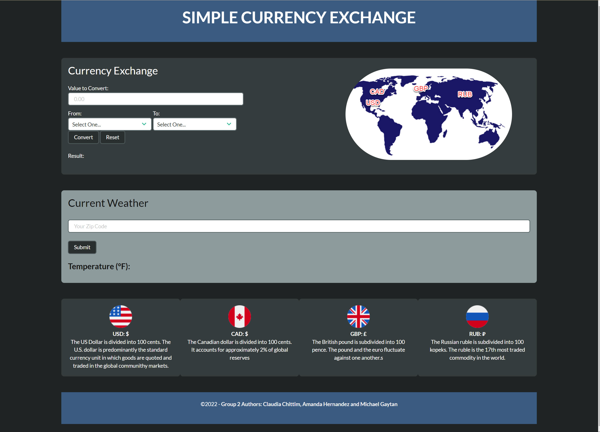

# This application is copyrighted in 2022. PLEASE DO NOT COPY
# Purpose of Currency Exchange Website Team 2

# User Story

In February of 2022, the Global Economy was impacted by a military threat imposed by Russia on a neighboring country. The U.S. and E.U. imposed sanctions on Russia and currency between nation states deceased to trade between countries in efforts to prevent a larger conflict.

People from all over the world felt the impact of inflation as gas prices increased and allied countries began to sanction oil imports from current dependants.

As sanctions occur, the global economy suffers the impact of increased energy costs and higher prices to import commodities from countries that were not sanctioned against or invaded.

The purpose of this website is to help people who are travelling and who have invested in stock markets to understand the price of currencies. The following four currencies are shown for those people who are affected by this event: the U.S. dollar, the Canadian dollar, the British pound and the Russian ruble.

Our target market includes people who are travelling abroad, refugees and people who have invested in these currencies on the foreign exchange markets.

As a person who would like to travel from the U.S. to the U.K. or E.U. and who has invested in the foreign exchange I want to know what the climate will be like and what value my currency has. To determine this I simply access the Team 2 website and select which of the 4 currencies I would like to convert.

# Description of Site

This site features currency conversion in four major currencies: the USD, the GBP, the CAD and the RUB. It also features a weather dashboard designed to help the end-user discover the weather in a certain region.

# Live Site

https://c0y01202.github.io/currency_exchange_site/

# External Resources

https://ajax.googleapis.com/ajax/libs/jquery/3.5.1/jquery.min.js
https://cdnjs.cloudflare.com/ajax/libs/popper.js/1.16.0/umd/popper.min.js
https://maxcdn.bootstrapcdn.com/bootstrap/4.5.2/js/bootstrap.min.js
https://maxcdn.bootstrapcdn.com/bootstrap/4.5.2/js/bootstrap.min.js
https://money.cnn.com/data/currencies/

Authors of this website:
Claudia Chittim, Michael Gaytan and Amanda Hernandez. Copyright 2022.

